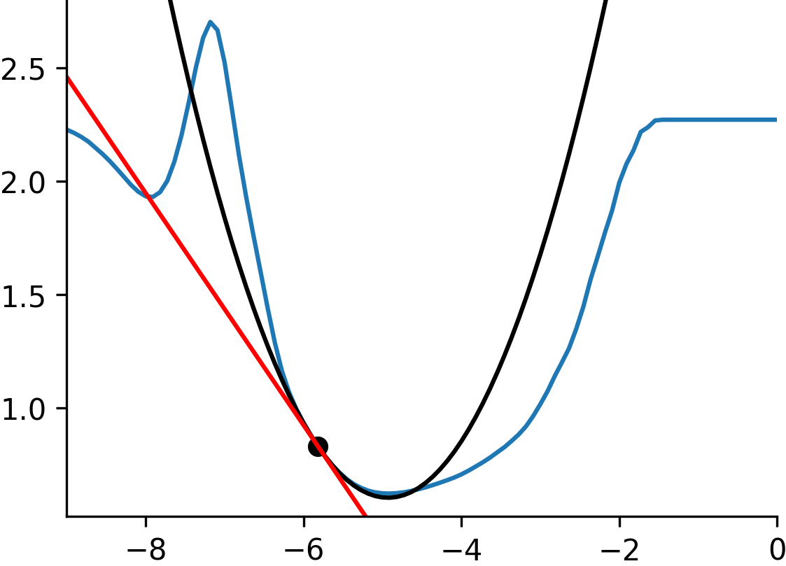

# Optimization Sensitivity in PyTorch - Reference Documentation - First- and Second-order Optimization

``sensitivity_torch`` is a package designed to allow taking first- and
**second-order** derivatives through optimization or any other fixed-point
process.

Source code for this package is located here
[github.com/rdyro/sensitivity_torch](https://github.com/rdyro/sensitivity_torch)

This package builds on top of [PyTorch](https://pytorch.org/). We also
maintain an implementation in [JAX](https://github.com/google/jax)
[here](https://rdyro.github.io/sensitivity_jax/).

---

    

